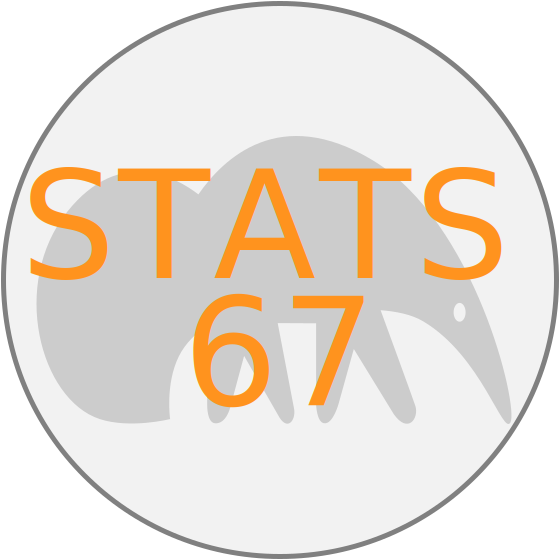

## Stats 67 

  
### Introduction to Probability and Statistics for Computer Science 
University of California Irvine 

Summer II 2020 

[Dr. Mine Dogucu](https://minedogucu.com)  
Course TA: Federica Zoe Ricci
    

Introduction to the basic concepts of probability and statistics with discussion of applications to computer science.

Course website is hosted at [stats4cs.com](https://stats4cs.com).

**Students** if you see anything missing or broken links please feel free to file an issue in this repo or let me know. Note that this is a public repo so if you create an issue it would be publicly be available. If you are concerned about privacy you can directly email me.

**Instructors** if you are planning to use any of the website design or resources feel free to do so but please attribute accordingly. 

This work is licensed under [Creative Commons Attribution-NonCommercial-ShareAlike 4.0 International License](http://creativecommons.org/licenses/by-nc-sa/4.0/).

