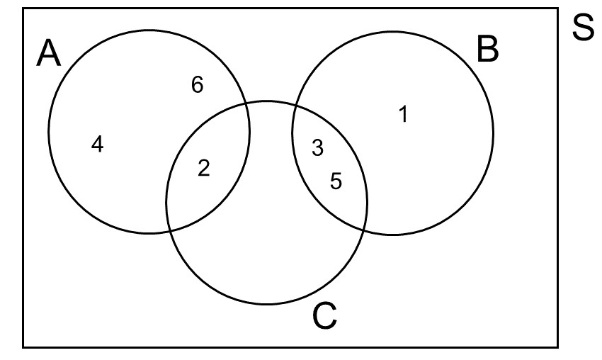

layout: true
  
<div class="my-header"></div>

<div class="my-footer"> 
 Copyright &copy; <a href="https://mdogucu.ics.uci.edu">Dr. Mine Dogucu</a>. <a href="https://creativecommons.org/licenses/by-nc-sa/4.0/">CC BY-NC-SA 4.0</a></div> 

---

class: middle

## Random process

In random processes there is more than one possible outcome and the deterministic prediction of the outcome is difficult.

e.g. flip of a coin  
e.g. roll of a die


---

## Sample Space

.pull-left[
<br>
**Sample space** is the set of all possible outcomes of a random process.

In a single roll of a die:

$S = \{ 1, 2, 3, 4, 5, 6\}$


In flipping a single coin twice:

$S = \{ HH, TT, HT, TH\}$

]

.pull-right[

<br>

```{r fig.align='center', out.width="40%", echo = FALSE}
knitr::include_graphics("https://cdn.pixabay.com/photo/2014/04/03/00/37/die-308887_960_720.png")


```

]


---

## Event

An __event__ is a subset of the sample space.

--

Let A represent the event that a single roll die results in an **even** number.

$A = \{2, 4, 6 \}$

--

Let B represent the event that a single roll die results in an **odd** number.

$B = \{1, 3, 5 \}$

--

Let C represent the event that a single roll die results in a **prime** number.

$C = \{2, 3, 5 \}$

---

## Venn Diagram

```{r fig.align='center', out.width="60%", echo = FALSE}



```

---

## Complement of an Event

.pull-left[

**Definition** Complement of an event is the set of all outcomes in the sample space that are not in the event itself.

**Example** Complement of event $C$ is the set of outcomes in a roll die that are not prime.

**Notation** $C^c$

**Pronunciation** C complement

$C^c = \{1, 4, 6\}$

]


.pull-right[

```{r fig.align='center', out.width="100%", echo = FALSE}


```
]

---

## Mutually Exclusive or Disjoint Events

.pull-left[

**Definition** Mutually exclusive or disjoint events are two events that cannot happen at the same time

**Example** Events A and B are mutually exclusive because an outcome of a roll of a die cannot be even *and* odd.

Events A and C are *not* mutually exclusive because 2 is both an even number and a prime number so event A and C can happen simultaneously. 


]


.pull-right[

```{r fig.align='center', out.width="100%", echo = FALSE}


```
]

---


## Events and Set Notation


.pull-left[
<br>
<br>
<div align ="center">

```{r echo = FALSE}

set_table <- data.frame(Description = c("Union", "Intersection"),
                        Notation = c("\\(A \\cup C\\)", 
                                   "\\(A \\cap C\\)"),
                        Reading = c("A or C", "A and C"),
                        Elements = c("{2, 3, 4, 5, 6}",
                        "{2}"))


kableExtra::kable(set_table, "html", escape = FALSE)

``` 

</div>

]

.pull-right[

```{r fig.align='center', out.width="100%", echo = FALSE}


```
]


---


## Defining Probability

**Frequentist definition**

The probability of an outcome is defined to be the proportion of times the outcome is observed under high number of repetitions of the random process.

--

Assume that we are repeating the random process of a coin flip and are recording $X$, the number of heads in $n$ coin flips. Then

$$P(H) = \lim_{n\to\infty}\frac{X}{n}$$
---

## Defining Probability


**Bayesian definition**

When defining probability in addition to considering number of times an outcome occurs, Bayesians consider prior information that they have about an outcome. 

More on this in Stats 115.


---

## Axioms of Probability


1) The probability of any event is between zero and one:

$$0 \leq P(A) \leq 1$$

--

2) The probabilities must add up to 1. 

$$P(S) = 1$$
--

3) The probability of mutually exclusive events is additive. 

$$\bigcup\limits_{i=1}^{\infty} A_{i} = \Sigma_{i =1}^\infty P(A_i)$$

---

## Probability of Complementary Events

$P(A) + P(A^c) = 1$

---

## Independence and Multiplication Rule

Two processes are independent if knowing about the outcome of one does not help predict the outcome of the other. 

e.g. two flips of a single coin

--

If events A and B are from two independent processes, then

$P(A \cap B) = P(A) \times P(B)$