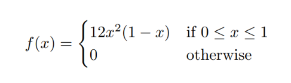

layout: true
  
<div class="my-header"></div>

<div class="my-footer"> 
 Copyright &copy; <a href="https://mdogucu.ics.uci.edu">Dr. Mine Dogucu</a>. <a href="https://creativecommons.org/licenses/by-nc-sa/4.0/">CC BY-NC-SA 4.0</a></div> 


---

class: middle

## Continuous Random Variables

A continuous random variable $X$ would have a sample space ( $S_X$ ) that is uncountably infinite. 

--

Let X be the the proportion of bike owners on campus. Then $S_x = [0, 1]$.

--

Let Y be the the survival time after some surgery. Then $S_Y = [0, \infty)$.

---

## Probability Density Function (pdf) - $f(x)$

A probability __density__ function gives the relative likelihood of the continuous random variable within the sample space.

$$f(x) \geq0 \text{ for all } x \ \epsilon \ S_X$$

--

$$\int_{x \ \epsilon \ S_X} f(x)dx = 1$$
--

$$P(X\ \epsilon \ B) = \int_{x \ \epsilon \ B} f(x)dx$$
---

## Example - pdf

.pull-left[

```{r echo = FALSE, fig.align = 'center', out.width ="90%"}

```
]

.pull-right[
```{r echo = FALSE, message = FALSE, fig.align="center", fig.height =4}
library(tidyverse)
theme_set(theme_gray(base_size = 22))

x <- seq(0,1, by = 0.1)


y <- 12*(x^2)*(1-x)

data <- data.frame(x = x,
                   y = y)

ggplot(data = data.frame(x = c(0, 1)), aes(x)) +
  stat_function(fun = function(x){12*(x^2)*(1-x)}) +
  labs(y = "f(x)")


```
]

--

$x^2 \geq0$

--

$(1-x) \geq0$


--
`r fontawesome::fa(name = "check")` $f(x) \geq0 \text{ for all } x \ \epsilon \ S_X$  


---

## Area Under the Curve = 1

.pull-left[

```{r echo = FALSE, fig.align = 'center', out.width ="90%"}

```
]

.pull-right[
```{r echo = FALSE, message = FALSE, fig.align="center", fig.height =4}
theme_set(theme_gray(base_size = 22))

x <- seq(0,1, by = 0.001)


y <- 12*(x^2)*(1-x)

data <- data.frame(x = x,
                   y = y)

pdf<-function(x){12*(x^2)*(1-x)}

ggplot(data = data.frame(x = c(0, 1)), aes(x)) +
  stat_function(fun = pdf) +
  labs(y = "f(x)") +
 geom_segment(data = data, aes(x = x, y = 0, xend = x, yend = y), color = "#e56646") 


```
]

--

$\int_0^1 12(x^2)(1-x)dx$
--
$12\int_0^1 (x^2-x^3)dx$ 
--
$12\big[\frac{x^3}{3} -\frac{x^4}{4}\bigg\rvert_0^1\big] = 1$
--

`r fontawesome::fa(name = "check")` $\int_{x \ \epsilon \ S_X} f(x)dx = 1$
---

## Probability is Area Under the Curve

.pull-right[

```{r echo = FALSE, fig.align = 'center', out.width ="90%"}

```

```{r echo = FALSE, message = FALSE, fig.align="center", fig.height =4}
theme_set(theme_gray(base_size = 22))

x <- seq(0.25,0.5, by = 0.001)


y <- 12*(x^2)*(1-x)

data <- data.frame(x = x,
                   y = y)

pdf<-function(x){12*(x^2)*(1-x)}

ggplot(data = data.frame(x = c(0, 1)), aes(x)) +
  stat_function(fun = pdf) +
  labs(y = "f(x)") +
 geom_segment(data = data,
              aes(x = x, 
                    y = 0, 
                    xend = x, 
                    yend = y), 
              color = "#e56646") 


```
]

$P(0.25<X<0.50) =$ 

$\int_{0.25}^{0.50} 12(x^2)(1-x)dx$

--

$12\int_{0.25}^{0.50} (x^2-x^3)dx$ 

--

$12\big[\frac{x^3}{3} -\frac{x^4}{4}\bigg\rvert_{0.25}^{0.50}\big] = 0.2617188$

--

`r fontawesome::fa(name = "check")` $P(X\ \epsilon \ B) = \int_{x \ \epsilon \ B} f(x)dx$ 

---

## $P(X=x_i) = 0$

.pull-right[

```{r echo = FALSE, fig.align = 'center', out.width ="90%"}

```

```{r echo = FALSE, message = FALSE, fig.align="center", fig.height =4}
theme_set(theme_gray(base_size = 22))

x <- seq(0.4,0.4, by = 0.001)


y <- 12*(x^2)*(1-x)

data <- data.frame(x = x,
                   y = y)

pdf<-function(x){12*(x^2)*(1-x)}

ggplot(data = data.frame(x = c(0, 1)), aes(x)) +
  stat_function(fun = pdf) +
  labs(y = "f(x)") +
 geom_segment(data = data,
              aes(x = x, 
                    y = 0, 
                    xend = x, 
                    yend = y), 
              color = "#e56646") 


```
]

$P(X=0.40) =$ 

$\int_{0.40}^{0.40} 12(x^2)(1-x)dx$

--

$12\int_{0.40}^{0.40} (x^2-x^3)dx$ 

--

$12\big[\frac{x^3}{3} -\frac{x^4}{4}\bigg\rvert_{0.40}^{0.40}\big] = 0$
---

## cdf

.pull-right[

```{r echo = FALSE, fig.align = 'center', out.width ="90%"}

```

```{r echo = FALSE, message = FALSE, fig.align="center", fig.height =4}
theme_set(theme_gray(base_size = 22))

x <- seq(0,0.7, by = 0.001)


y <- 12*(x^2)*(1-x)

data <- data.frame(x = x,
                   y = y)

pdf<-function(x){12*(x^2)*(1-x)}

ggplot(data = data.frame(x = c(0, 1)), aes(x)) +
  stat_function(fun = pdf) +
  labs(y = "f(x)") +
 geom_segment(data = data,
              aes(x = x, 
                    y = 0, 
                    xend = x, 
                    yend = y), 
              color = "#e56646") 


```
]

$P(X\leq x) = \int_l^x f(t)dt$ 


$P(X\leq 0.70) =$ 

$\int_{0}^{0.70} 12(t^2)(1-t)dt$

--

$12\big[\frac{t^3}{3} -\frac{t^4}{4}\bigg\rvert_{0}^{0.70}\big] = 0.6516996$

--

Note: $f(x) = \frac{dF(x)}{dx}$


---

## Expected Value

$E(X) = \int_{x \ \epsilon \ S_X} xf(x)dx$

--

$\int_0^1 x12(x^2)(1-x)dx$

--

$12\int_0^1 (x^3-x^4)dx$ 

--

$12\big[\frac{x^4}{4} -\frac{x^5}{5}\bigg\rvert_0^1\big] = 0.6$

---

## Variance

$Var(X) = E(X^2)- [E(X)]^2$

--

$E(X^2) = ?$

--

$E(X^2) = \int_0^1 x^212(x^2)(1-x)dx$

--

$E(X^2) = 12\int_0^1 (x^4-x^5)dx$ 

--

$E(X^2) = 12\big[\frac{x^5}{5} -\frac{x^6}{6}\bigg\rvert_0^1\big] = 0.4$

--

$Var(X) = 0.4- 0.6^2 = 0.04$
