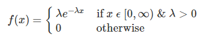

layout: true
  
<div class="my-header"></div>

<div class="my-footer"> 
 Copyright &copy; <a href="https://mdogucu.ics.uci.edu">Dr. Mine Dogucu</a>. <a href="https://creativecommons.org/licenses/by-nc-sa/4.0/">CC BY-NC-SA 4.0</a></div> 


---

## pdf

$X \sim \text{Exp}(\lambda)$


.pull-left[
```{r echo = FALSE, fig.align = 'center', out.width ="90%"}

```

]

.pull-right[

```{r echo = FALSE, message = FALSE, fig.align="center", fig.height = 4, message = FALSE, warning = FALSE}
library(tidyverse)
theme_set(theme_gray(base_size = 22))


ggplot(data = data.frame(x = c(0, 5)), aes(x)) +
  stat_function(fun = dexp, 
                n = 101, 
                args = list(rate = 0.5), 
                aes(color = "0.5")) + 
  stat_function(fun = dexp, 
                n = 101, 
                args = list(rate = 1), 
                aes(color = "1")) + 
  stat_function(fun = dexp, 
                n = 101,
                args = list(rate = 1.5), 
                aes(color = "1.5")) + 
  ylab("f(x)") +
  scale_y_continuous(breaks = NULL) +
  scale_colour_manual(name = expression(lambda),
  values = c("0.5" = "red", 
           "1" = "blue",
           "1.5" = "green")) 

```

]

---

## Expected Value and Variance

$E(X) = \frac{1}{\lambda}$

--


$Var(X) = \frac{1}{\lambda^2}$

---

## Example

Suppose your waiting time (in minutes) for a bus is $X \sim Exp(0.1)$. 

--

.pull-right[

```{r echo = FALSE, message = FALSE, fig.align="center", fig.height = 4, message = FALSE, warning = FALSE}

ggplot(data = data.frame(x = c(0, 30)), aes(x)) +
  stat_function(fun = dexp, 
                n = 101, 
                args = list(rate = 0.1)) +
  labs(y = "f(x)")

```

]


--

$f(x) =0.1 e^{-0.1 x} \text{ for } \  x \ \epsilon \ [0, \infty)$

--

$f(10) =0.1 e^{-0.1\cdot10}$

--

```{r}
0.1*exp(-0.1*10)
```

--

```{r}
dexp(x = 10, rate = 0.1)
```

---

## Calculating Probability

You show up at the bus stop. What is the probability that you will wait for 10 minutes for the bus?

--


.pull-right[

```{r echo = FALSE, message = FALSE, fig.align="center", fig.height =4, warning = FALSE}


data <- data.frame (x = 10,
                    y = dexp(10, 0.1))

ggplot(data = data.frame(x = c(0, 30)), aes(x)) +
  stat_function(fun = dexp, 
                n = 101, 
                args = list(rate = 0.1)) +
  labs(y = "f(x)") +
   geom_segment(data = data,
              aes(x = x, 
                    y = 0, 
                    xend = x, 
                    yend = y), 
              color = "#e56646") 
```


]

--


$P(X = 10) = 0$

--

$\int_{10}^{10}\lambda e^{-\lambda x}dx$


---

## Calculating Probability

What is the probability that you will wait for the bus less than 10 minutes?

--

.pull-right[

```{r echo = FALSE, message = FALSE, fig.align="center", fig.height =4, warning = FALSE}

x <- seq(0, 10, by = 0.001)
y <- dexp(x, 0.1)

data <- data.frame (x = x,
                    y = y)

ggplot(data = data.frame(x = c(0, 30)), aes(x)) +
  stat_function(fun = dexp, 
                n = 101, 
                args = list(rate = 0.1)) +
  labs(y = "f(x)") +
   geom_segment(data = data,
              aes(x = x, 
                    y = 0, 
                    xend = x, 
                    yend = y), 
              color = "#e56646") 
```

]


Cumulative probability!

--

$\int_{0}^{10}\lambda e^{-\lambda x}dx$

--

$\int_{0}^{10}0.1 e^{-0.1 x}dx$

--

```{r}
pexp(q = 10, rate = 0.1)
```

---

## Calculating Probability

What is the probability that you will wait between 10 to 20 minutes for the bus?

.pull-right[

```{r echo = FALSE, message = FALSE, fig.align="center", fig.height =4, warning = FALSE}

x <- seq(10, 20, by = 0.001)
y <- dexp(x, 0.1)

data <- data.frame (x = x,
                    y = y)

ggplot(data = data.frame(x = c(0, 30)), aes(x)) +
  stat_function(fun = dexp, 
                n = 101, 
                args = list(rate = 0.1)) +
  labs(y = "f(x)") +
   geom_segment(data = data,
              aes(x = x, 
                    y = 0, 
                    xend = x, 
                    yend = y), 
              color = "#e56646") 
```

]


$P(10<X<20) = ?$

--

$\int_{10}^{20}0.1 e^{-0.1 x}dx$


--

$P(X<20) - P(X<10)$

--

```{r}
pexp(q = 20, rate = 0.1) -
  pexp(q = 10, rate = 0.1)

```


---

## Expected Value and Variance

What is the expected value of the waiting time for a bus?

--

$E(X) = \frac{1}{\lambda}$

--

$E(X) = \frac{1}{0.1} = 10$ minutes

--

What is the variance  of the waiting time for a bus?

--

$Var(X) = \frac{1}{\lambda^2}$

--

$Var(X) = \frac{1}{0.1^2} = 100 \text{ minutes}^2$

---
class: middle 

.pull-left[

__Poisson__

`r fontawesome::fa(name = "bus")`

Discrete

Number of events (bus)

Every ten minutes we expect __1 bus__

]

.pull-right[

__Exponential__

`r fontawesome::fa(name = "clock")`

Continuous

Time between two events

We expect to wait __10 minutes__ for a bus

]


