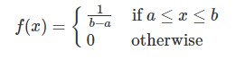

layout: true
  
<div class="my-header"></div>

<div class="my-footer"> 
 Copyright &copy; <a href="https://mdogucu.ics.uci.edu">Dr. Mine Dogucu</a>. <a href="https://creativecommons.org/licenses/by-nc-sa/4.0/">CC BY-NC-SA 4.0</a></div> 


---

## pdf 

$X \sim \mathcal{U}(a,b)$

.pull-left[
```{r echo = FALSE, fig.align = 'center', out.width ="90%"}

```

]

.pull-right[

```{r echo = FALSE, message = FALSE, fig.align="center", fig.height = 4, message = FALSE, warning = FALSE}
library(tidyverse)
theme_set(theme_gray(base_size = 22))


data <- data.frame (x_label = rep (c("a", "b")),
                   x = rep (c(0,1)),
                   y_label = c("1/(b-a)", "1/(b-a)"),
                   y = c(1,1))

ggplot(data, aes(x = x, y = y)) + 
  geom_line ()+
  scale_x_continuous(breaks = data$x, 
                     labels = data$x_label) +
  scale_y_continuous(breaks = data$y, 
                     labels = data$y_label) +
  labs(y = "f(x)")
```

]

---

## Expected Value

$E(X) = \int_{x \ \epsilon \ S_X} xf(x)dx$

--

$E(X) = \int_a^b x\frac{1}{b-a}dx$

--

$E(X) = \frac{1}{b-a} \big[\frac{x^2}{2}\bigg\rvert_a^b\big]$

--

$E(X) = \frac{1}{b-a} \big[\frac{b^2}{2} - \frac{a^2}{2}\big]$

--

$E(X) = \frac{b^2 - a^2}{2(b-a)}$

--

$E(X) = \frac{b+a}{2}$

---

## $E(X^2)$

$Var(X) = E(X^2)- [E(X)]^2$

--

$E(X^2) = ?$

--

$E(X^2) = \int_a^b x^2\frac{1}{b-a}dx$

--

$E(X^2) = \frac{1}{b-a} \big[\frac{x^3}{3}\bigg\rvert_a^b\big]$

--

$E(X^2) = \frac{b^3 - a^3}{3(b-a)}$

---

## Variance

$Var(X) = E(X^2)- [E(X)]^2$

--

$Var(X) =  \frac{b^3 - a^3}{3(b-a)}- (\frac{b+a}{2})^2$

--

$Var(X) =  \frac{(b-a) (b^2+ab+a^2)}{3(b-a)}- \frac{(b+a)^2}{4}$

--

$Var(X) =  \frac{(b-a)^2}{12}$

---

## Example

A cellphone has a defective alarm system. Once every day the alarm starts ringing randomly. Let X be the random variable representing the time in the
24 hour system when the alarm goes on. 

--

.pull-right[

```{r echo = FALSE, message = FALSE, fig.align="center", fig.height = 4, message = FALSE, warning = FALSE}
library(tidyverse)
theme_set(theme_gray(base_size = 22))


data <- data.frame (x = rep (c(0,24)),
                   y = c(1/24,1/24),
                   y_label = c("1/24", "1/24"))

ggplot(data, aes(x = x, y = y)) + 
  geom_line ()+
  scale_x_continuous(breaks = data$x) +
  scale_y_continuous(breaks = data$y,
                     labels = data$y_label) +
  labs(y = "f(x)")
```

]

--

$f(x) = \frac{1}{b-a} \text{ for } \  a \leq x \leq b$

$f(x) = \frac{1}{24-0} \text{ for } x \ \epsilon [0,24)$

---

## pdf

.pull-right[

```{r echo = FALSE, message = FALSE, fig.align="center", fig.height = 4, message = FALSE, warning = FALSE}
library(tidyverse)
theme_set(theme_gray(base_size = 22))


data <- data.frame (x = rep (c(0,24)),
                   y = c(1/24,1/24),
                   y_label = c("1/24", "1/24"))

ggplot(data, aes(x = x, y = y)) + 
  geom_line ()+
  scale_x_continuous(breaks = data$x) +
  scale_y_continuous(breaks = data$y,
                     labels = data$y_label) +
  labs(y = "f(x)")
```

]

.pull-left[

```{r}
dunif(x = 3, min = 0, max = 24)
```

]

--

.pull-left[

```{r}
dunif(x = 15, min = 0, max = 24)
```

]

--

.pull-left[

```{r}
dunif(x = 21.25, min = 0, max = 24)
```

]
---

## Calculating Probability

What is the probability that the phone alarm will ring at 3 am?

--


.pull-right[

```{r echo = FALSE, message = FALSE, fig.align="center", fig.height =4, warning = FALSE}
data <- data.frame (x = rep (c(0,24)),
                   y = c(1/24,1/24),
                   y_label = c("1/24", "1/24"))

ggplot(data, aes(x = x, y = y)) + 
  geom_line ()+
  scale_x_continuous(breaks = data$x) +
  scale_y_continuous(breaks = data$y,
                     labels = data$y_label) +
  labs(y = "f(x)") +
   geom_segment(data = data,
              aes(x = 3, 
                    y = 0, 
                    xend = 3, 
                    yend = y), 
              color = "#e56646") 
```


]

--


$P(X = 3) = 0$


$\int_3^{3}\frac{1}{b-a}dx = 0$

--

---

## Calculating Probability

What is the probability that the phone alarm will ring at some time between midnight and 8 am?

--

.pull-right[

```{r echo = FALSE, message = FALSE, fig.align="center", fig.height =4, warning = FALSE}
x <- seq(0,8, by = 0.001)


y <- rep(1/24, times = length(x))

data <- data.frame(x = x,
                   y = y)

ggplot(data = data.frame(x = c(0, 24)), 
       aes(x = x, y = 1/24)) + 
  geom_line ()+
  labs(y = "f(x)") +
   geom_segment(data = data,
              aes(x = x, 
                    y = 0, 
                    xend = x, 
                    yend = y), 
              color = "#e56646") +
  scale_y_continuous(breaks = c(0, 1/24),
                     labels = c("0", "1/24")) +
  labs(y = "f(x)") 

```

]


Cumulative probability!

--

$\int_0^{8}\frac{1}{b-a}dx$

--


$\frac{x}{b-a}\bigg\rvert_0^8 = \frac{8}{24} = \frac{1}{3}$

--

```{r}
punif(q = 8, min = 0, max = 24)
```

---

## Calculating Probability

What is the probability that the phone alarm will ring at some time between 2 am to 8 am?

--


.pull-right[
```{r echo = FALSE, message = FALSE, fig.align="center", fig.height =4, warning = FALSE}
x <- seq(2,8, by = 0.001)


y <- rep(1/24, times = length(x))

data <- data.frame(x = x,
                   y = y)

ggplot(data = data.frame(x = c(0, 24)), 
       aes(x = x, y = 1/24)) + 
  geom_line ()+
  labs(y = "f(x)") +
   geom_segment(data = data,
              aes(x = x, 
                    y = 0, 
                    xend = x, 
                    yend = y), 
              color = "#e56646") +
  scale_y_continuous(breaks = c(0, 1/24),
                     labels = c("0", "1/24")) +
  labs(y = "f(x)") 

```

]

$P(2<X<8) = ?$

--

$\frac{x}{b-a}\bigg\rvert_2^8 = \frac{8}{24} - \frac{2}{24}= \frac{1}{4}$

--

$P(X<8) - P(X<2)$

--

```{r}
punif(q = 8, min = 0, max = 24) -
  punif(q = 2, min = 0, max = 24)
```


---

## Expected Value

What is the expected value of the time that the phone alarm will go on?

--

$E(X) = \frac{b+a}{2}$

--

$E(X) = \frac{24+0}{2}$

--

$E(X) = 12$

--

We found that the expected value is 12. Does that mean that every day we would expect the alarm to go on at noon (12 pm)?

--

No! Some days the alarm might go on at 9 am, some days at 3 pm (15). Some days it might go on at 9:15 pm (21.25). We would expect the average to be 12 in the long run.

---

## Variance

We already pointed out that there is variance to the time the alarm goes on. It is not at noon every day. What is the variance of the time that the phone alarm will go on?

--

$Var(X) =  \frac{(b-a)^2}{12}$

--

$Var(X) =  \frac{(24-0)^2}{12}$

--

$Var(X) = 48$


