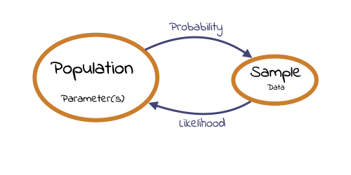
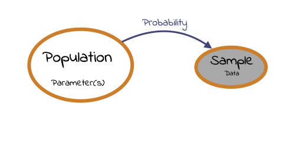
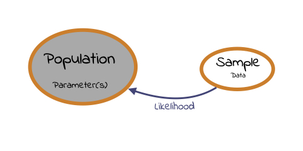

layout: true
  
<div class="my-header"></div>

<div class="my-footer"> 
 Copyright &copy; <a href="https://mdogucu.ics.uci.edu">Dr. Mine Dogucu</a>. <a href="https://creativecommons.org/licenses/by-nc-sa/4.0/">CC BY-NC-SA 4.0</a></div> 


---

```{r echo = FALSE, message = FALSE}
library(tidyverse)
theme_set(theme_gray(base_size = 18))
```

class: middle 


```{r echo = FALSE, fig.align='center'}

```

.footnote[Modified from an image by Federica Ricci]
---

```{r echo = FALSE, fig.align='center', out.width="50%"}

```

Let $X\sim \text{Bernoulli}(p)$

If we flip a __fair__ coin, what is the **probability** that we get a head (success)?

--

Parameter p is known, $p = 0.5$

--

We would like to know what $P(X = 1)$ is.

---

## Likelihood

```{r echo = FALSE, fig.align='center', out.width = "50%"}

```

--

If we observe a head what is the **likelihood** that p is 0.5?

--

We know that $x = 1$ and we would like to know $L(p = 0.5 | x = 1)$

---

## Probability

Let $X \sim \text{Binomial}(n = 2, p = 0.3)$

Let X be the number of spam emails received among two emails with a 0.3 probability of spam email.

--

What is the probability that one of the two emails received is spam?

--

$P(X = 1)$ =

```{r}
dbinom(x = 1, size = 2, prob = 0.3)
```

---

## Likelihood

Let $X \sim \text{Binomial}(n, p)$

There were 5 emails received and 3 of them turned out to be spam. What is the likelihood that $p$ is 0.1 (i.e. $L(p = 0.1 | x = 3)$?

--

```{r}
dbinom(x = 3, size = 5, prob = 0.1)
```

---

class: middle

What about $L(p = 0.8 | x = 3)$?

```{r}
dbinom(x = 3, size = 5, prob = 0.8)
```

--

<hr>

What about $L(p = 0.5 | x = 3)$?

```{r}
dbinom(x = 3, size = 5, prob = 0.5)
```


---

.pull-left[

<br>


| p   | L(p &#124; x = 3)                           |
|-----|-----------------------------------------|
| 0   | `r dbinom(x = 3, size = 5, prob = 0)` |
| 0.1 | `r dbinom(x = 3, size = 5, prob = 0.1)`                                        |
| 0.2 | `r dbinom(x = 3, size = 5, prob = 0.2)`                                        |
| 0.3 | `r dbinom(x = 3, size = 5, prob = 0.3)`                                        |
| 0.4 | `r dbinom(x = 3, size = 5, prob = 0.4)`                                        |
| 0.5 | `r dbinom(x = 3, size = 5, prob = 0.5)`                                        |
| 0.6 | `r dbinom(x = 3, size = 5, prob = 0.6)`                                        |
| 0.7 | `r dbinom(x = 3, size = 5, prob = 0.7)`                                        |
| 0.8 | `r dbinom(x = 3, size = 5, prob = 0.8)`                                        |
| 0.9 | `r dbinom(x = 3, size = 5, prob = 0.9)`                                        |
| 1   | `r dbinom(x = 3, size = 5, prob = 1)`                                        |

]


.pull-right[

<br>

```{r echo = FALSE}
p <- seq(0, 1, by = 0.1)
likelihood <- dbinom(3, 5, p)

data.frame(p, likelihood) %>% 
  ggplot(aes(x = p, y = likelihood)) +
  geom_point() +
  scale_x_continuous(breaks = p) +
  ylab("L(p)")
  
```
]

---

## Likelihood

.pull-left[
```{r echo = FALSE, fig.height = 5.5}
p <- seq(0, 1, by = 0.001)
likelihood <- dbinom(3, 5, p)

data.frame(p, likelihood) %>% 
  ggplot(aes(x = p, y = likelihood)) +
  geom_point(size = 0.01) +
  ylab("L(p)") +
  geom_segment(x = 0.6, xend = 0.6, y = 0, yend = dbinom(3,5,0.6), color = "#CC6600")
  
```

]
--

.pull-right[

- Likelihood is a function.

- We call 0.6 the maximum likelihood estimate (MLE) of $p$ where the function reaches its maximum value.

- A maximum likelihood estimate, in this case, is our best estimate of the unknown parameter $p$.
]

---
class: center middle
.subtopic-note[Math Review]

---

## Review

$\ln(ab) = \ln(a) + \ln(b)$

--

$\ln(a^b) = b\ln(a)$

--

$\frac{d}{dx}x^n = nx^{n-1}$

--

$\frac{d}{dx}e^x = e^x$

--

$\frac{d}{dx}\ln x = \frac{1}{x}$

--

$\frac{d}{dx}\ln (1-x) = -\frac{1}{(1-x)}$


---

class: center middle
.subtopic-note[MLE]

---

**Deriving MLE for p**

Let $X \sim \text{Bernoulli(p)}$ and $x_1, x_2,...x_n$ following this distribution.

--
e.g. 1, 1, 0, 0 ,1 

$x_1 = 1, x_2 = 1, x_3 = 0, x_4 = 0, x_5 = 1$

--

$x_1 = 1, x_2 = 1, x_3 = 0, x_4 = 0, x_5 = 1$ and $n = 5$

--

$L(p) = p^{x_1}(1-p)^{1-x_1} p^{x_2}(1-p)^{1-x_2}.... p^{x_n}(1-p)^{1-x_n}$

--

$L(p) = \prod_{i=1}^{n} p^{x_i}(1-p)^{1-x_i}$

--

$L(p) = p^{\sum_{i=1}^nx_i}(1-p)^{\sum_{i=1}^n1-x_i}$

---

**Steps**

We want to find the maximum  value of $p$. 

1. Find $L(p)$  `r fontawesome::fa(name = "check", fill = "#e56646")`

2. Take the first derivative of the likelihood with respect to the parameter, in this case $p$.

3. Set the first derivative equal to 0 and solve for p.

4. Check whether the second derivative of the likelihood is negative.


---


**Steps**

We want to find the maximum  value of $p$. 

1. Find $L(p)$  `r fontawesome::fa(name = "check", fill = "#e56646")`

1. .formula[Find ln L(p)] 

2. Take the first derivative of the likelihood with respect to the parameter, in this case $p$.

3. Set the first derivative equal to 0 and solve for p.

4. Check whether the second derivative of the likelihood is negative.

---

class: middle

## Step 2: Find ln L(p)

$\ell(p) = \ln L(p) = \ln[p^{\sum_{i=1}^nx_i}(1-p)^{\sum_{i=1}^n1-x_i}]$

--

$\ell(p)= {\sum_{i=1}^nx_i}\ln(p) + n-{\sum_{i=1}^nx_i}\ln(1-p)$

---

class:middle

## Step 3: Take the first derivative with respect $p$

$\frac{d}{dp}\ell(p) = \frac{d}{dp}[{\sum_{i=1}^nx_i}\ln(p) + n-{\sum_{i=1}^nx_i}\ln(1-p)]$


--

$\frac{d}{dp}\ell(p) = \frac{\sum_{i=1}^nx_i}{p} + \frac{n-{\sum_{i=1}^nx_i}}{1-p} (-1)$

--

$\frac{d}{dp}\ell(p) = \frac{\sum_{i=1}^nx_i}{p} - \frac{n-{\sum_{i=1}^nx_i}}{1-p}$

---

class:middle

## Step 4: Set the first derivative equal to 0 and solve for p

--

$\frac{\sum_{i=1}^nx_i}{p} - \frac{n-{\sum_{i=1}^nx_i}}{1-p} = 0$

$\frac{\sum_{i=1}^nx_i}{p} = \frac{n-{\sum_{i=1}^nx_i}}{1-p}$

$\sum_{i=1}^nx_i -p \sum_{i=1}^nx_i= pn-p\sum_{i=1}^nx_i$

$\sum_{i=1}^nx_i= p n$

$\hat p = \frac{\sum_{i=1}^nx_i}{n}$


---

class:middle

## Step 5: Check that the second derivative is always negative

$\frac{d^2}{d^2p}\ell(p) = \frac{d}{dp}[\frac{\sum_{i=1}^nx_i}{p} - \frac{n-{\sum_{i=1}^nx_i}}{1-p}]$

--

$\frac{d^2}{d^2p}\ell(p) = -\frac{\sum_{i=1}^nx_i}{p^2} - \frac{n-{\sum_{i=1}^nx_i}}{(1-p)^2}$

--

$\sum_{i=1}^nx_i \geq 0$

--
and $n-\sum_{i=1}^nx_i \geq 0$

--
and $n \geq\sum_{i=1}^nx_i$

--

$p^2 >0$

--
and $(1-p)^2 > 0$

--

$-\frac{\sum_{i=1}^nx_i}{p^2} - \frac{n-{\sum_{i=1}^nx_i}}{(1-p)^2} <0$ `r fontawesome::fa(name = "check", fill = "#e56646")`

---

class: middle

## Conclusion

$\hat p = \frac{\sum_{i=1}^nx_i}{n}$ is in fact the maximum likelihood estimator of $p$.


---

Let's use this estimator!

--

Let X represent a random variable with a binomial distribution. We have observed 3 successes in 5 trials. What is the maximum likelihood of $p$?

--

5 Bernoulli trials so $n = 5$

--

3 successes so $\sum_{i=1}^nx_i = 3$


--

$\hat p = \frac{\sum_{i=1}^nx_i}{n} = \frac{3}{5} = 0.6$ 

--

p is most likely $\frac{3}{5} = 0.6$

---

class: middle

Let X represent number of failures that follows a Geometric distribution. We have observed the first success at the 10th trial. What is the maximum likelihood of $p$? 

--

$n = 10$

--

Geometric distribution always has failures first so $x_1 = 0, x_2, = 0....x_8 =0, x_9 = 0$ but $x_{10}=1$.

--

$\sum_{i=1}^nx_i =1$

--

$\hat p = \frac{\sum_{i=1}^nx_i}{n} = \frac{1}{10} = 0.1$ 


